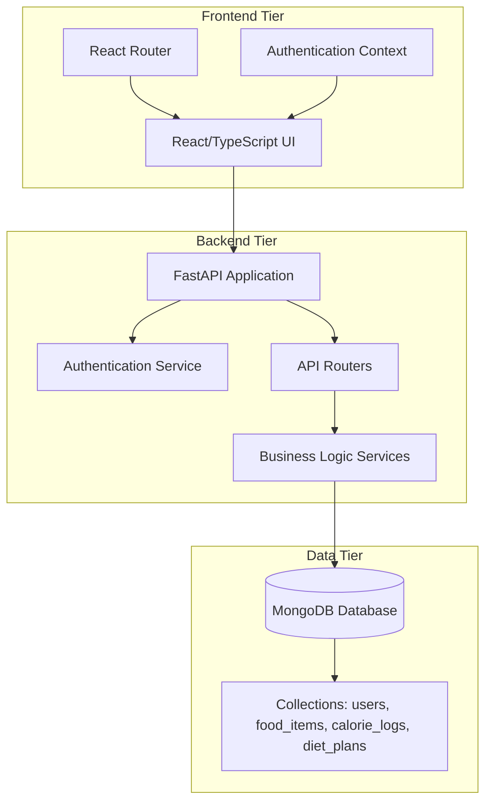

# Design Document: Calorie Tracker Application

## Overview

The Calorie Tracker Application is a full-stack web application designed to help users monitor their daily caloric intake and manage their nutritional goals. The system follows a modern microservices architecture with a FastAPI backend providing RESTful APIs and a React/TypeScript frontend delivering an intuitive user experience.

The application enables users to:
- Register and authenticate securely
- Manage a comprehensive food item database
- Log daily calorie consumption
- Create and manage personalized diet plans
- Track nutritional progress over time

## Architecture

The system follows a three-tier architecture pattern:



### Technology Stack

**Backend:**
- FastAPI: High-performance Python web framework
- MongoDB: Document-based NoSQL database
- PyMongo: MongoDB driver for Python
- Pydantic: Data validation and serialization
- JWT: Token-based authentication
- Passlib: Password hashing

**Frontend:**
- React 19: Component-based UI framework
- TypeScript: Type-safe JavaScript
- React Router: Client-side routing
- Axios: HTTP client for API communication
- Local Storage: Token persistence

## Components and Interfaces

### Backend Components

#### 1. Authentication Service (`backend/auth/auth.py`)
Handles user authentication, token generation, and password management.

**Key Functions:**
```python
async def authenticate_user(username: str, password: str) -> User | None
def create_access_token(data: dict, expires_delta: timedelta) -> str
def get_password_hash(password: str) -> str
async def get_current_user(token: str) -> User
```

#### 2. Data Models (`backend/models/`)
Pydantic models defining data structures and validation rules.

**User Model:**
```python
class User(BaseModel):
    id: Optional[PyObjectId]
    username: str
    email: str
    hashed_password: str
```

**Food Item Model:**
```python
class FoodItem(BaseModel):
    id: Optional[PyObjectId]
    name: str
    calories: float
    protein: float
    carbohydrates: float
    fat: float
```

**Calorie Log Model:**
```python
class CalorieLog(BaseModel):
    id: Optional[PyObjectId]
    user_id: PyObjectId
    food_item_id: PyObjectId
    quantity: float
    calories_consumed: float
    log_date: date
```

**Diet Plan Model:**
```python
class DietPlan(BaseModel):
    id: Optional[PyObjectId]
    user_id: PyObjectId
    name: str
    target_calories: float
    meals: List[Meal]
    created_at: date
```

#### 3. API Routers (`backend/routers/`)
RESTful endpoint implementations organized by resource type.

**Authentication Router:**
- `POST /token` - User login
- `GET /users/me` - Get current user profile
- `POST /logout` - User logout

**Food Items Router:**
- `POST /food-items` - Create food item
- `GET /food-items` - List all food items
- `GET /food-items/{id}` - Get specific food item
- `PUT /food-items/{id}` - Update food item
- `DELETE /food-items/{id}` - Delete food item

**Calorie Logs Router:**
- `POST /calorie-logs` - Create calorie log
- `GET /calorie-logs` - Get user's calorie logs
- `GET /calorie-logs/daily/{date}` - Get daily calorie logs
- `GET /calorie-logs/{id}` - Get specific calorie log
- `PUT /calorie-logs/{id}` - Update calorie log
- `DELETE /calorie-logs/{id}` - Delete calorie log

**Diet Plans Router:**
- `POST /diet-plans` - Create diet plan
- `GET /diet-plans` - Get user's diet plans
- `GET /diet-plans/{id}` - Get specific diet plan
- `PUT /diet-plans/{id}` - Update diet plan
- `DELETE /diet-plans/{id}` - Delete diet plan

### Frontend Components

#### 1. Authentication Components
- `Login.tsx`: User login form with credential validation
- `Register.tsx`: User registration form with input validation

#### 2. Core Feature Components
- `CalorieTracker.tsx`: Calorie logging interface with daily summaries
- `FoodItems.tsx`: Food item management interface
- `DietPlans.tsx`: Diet plan creation and management interface

#### 3. Navigation and Layout
- `App.tsx`: Main application component with routing
- Navigation bar with links to all major features

## Data Models

### Database Schema

The MongoDB database contains four main collections:

#### Users Collection
```json
{
  "_id": ObjectId,
  "username": "string (unique)",
  "email": "string (unique)",
  "hashed_password": "string"
}
```

#### Food Items Collection
```json
{
  "_id": ObjectId,
  "name": "string",
  "calories": "number",
  "protein": "number",
  "carbohydrates": "number",
  "fat": "number"
}
```

#### Calorie Logs Collection
```json
{
  "_id": ObjectId,
  "user_id": ObjectId,
  "food_item_id": ObjectId,
  "quantity": "number",
  "calories_consumed": "number",
  "log_date": "date"
}
```

#### Diet Plans Collection
```json
{
  "_id": ObjectId,
  "user_id": ObjectId,
  "name": "string",
  "target_calories": "number",
  "meals": [
    {
      "food_item_id": ObjectId,
      "quantity": "number"
    }
  ],
  "created_at": "date"
}
```

### Data Relationships

- Users have one-to-many relationships with CalorieLogs and DietPlans
- CalorieLogs reference FoodItems through food_item_id
- DietPlan meals reference FoodItems through food_item_id
- All user-specific data is isolated by user_id for security

### Data Validation Rules

- ObjectIds must be valid MongoDB ObjectIds
- Email addresses must follow valid email format
- Passwords are hashed before storage
- Numeric values (calories, quantities) must be positive
- Dates use ISO format (YYYY-MM-DD)
- Required fields are enforced at the Pydantic model level

## Correctness Properties

*A property is a characteristic or behavior that should hold true across all valid executions of a system—essentially, a formal statement about what the system should do. Properties serve as the bridge between human-readable specifications and machine-verifiable correctness guarantees.*

### Property 1: User Registration with Unique Constraints
*For any* valid user registration data, if the username and email are unique, then the system should create a new user account and return an access token
**Validates: Requirements 1.1**

### Property 2: Duplicate Registration Prevention
*For any* registration attempt with an existing username or email, the system should reject the registration and return an appropriate error message
**Validates: Requirements 1.2, 1.3**

### Property 3: Authentication Token Generation
*For any* registered user with correct credentials, the authentication service should generate and return a valid access token
**Validates: Requirements 1.4**

### Property 4: Invalid Credential Rejection
*For any* login attempt with incorrect credentials, the authentication service should reject the attempt and return an unauthorized error
**Validates: Requirements 1.5**

### Property 5: Food Item CRUD Operations
*For any* authenticated user and valid food item data, the system should support create, read, update, and delete operations while maintaining data consistency
**Validates: Requirements 2.1, 2.2, 2.3, 2.4, 2.5**

### Property 6: Calorie Calculation Accuracy
*For any* calorie log creation or update, the system should calculate calories consumed as the product of food item calories and quantity
**Validates: Requirements 3.1, 3.4**

### Property 7: User Data Isolation
*For any* user requesting their personal data (calorie logs or diet plans), the system should return only data belonging to that user
**Validates: Requirements 3.2, 4.2**

### Property 8: Date-Based Filtering
*For any* user requesting calorie logs for a specific date, the system should return all logs for that date belonging to that user
**Validates: Requirements 3.3**

### Property 9: Resource Deletion Consistency
*For any* user-owned resource (calorie log, diet plan, food item), when deleted, the resource should no longer be retrievable through any endpoint
**Validates: Requirements 2.5, 3.5, 4.5**

### Property 10: Referential Integrity Validation
*For any* operation that references another resource by ID, the system should validate the reference exists or return a not found error
**Validates: Requirements 3.6**

### Property 11: Diet Plan Validation
*For any* diet plan creation or update, the system should validate all meal data references valid food items
**Validates: Requirements 4.1, 4.4, 4.6**

### Property 12: Authentication Middleware Protection
*For any* protected endpoint access, the system should verify the user's access token or return an unauthorized error
**Validates: Requirements 5.2, 5.3**

### Property 13: Password Security
*For any* user password storage, the system should hash the password using secure algorithms and never store plain text
**Validates: Requirements 5.4**

### Property 14: Data Persistence Consistency
*For any* data creation or modification operation, the changes should be immediately available in subsequent queries
**Validates: Requirements 7.1**

### Property 15: Date Format Consistency
*For any* date storage or retrieval, the system should use consistent ISO date formats (YYYY-MM-DD)
**Validates: Requirements 7.4**

### Property 16: HTTP Status Code Accuracy
*For any* API operation, the system should return appropriate HTTP status codes that match the operation result
**Validates: Requirements 8.1, 8.2, 8.5, 8.6**

### Property 17: Validation Error Detail
*For any* request with invalid data, the system should return detailed validation error messages
**Validates: Requirements 8.3**

### Property 18: ObjectId Format Validation
*For any* endpoint that accepts ObjectId parameters, the system should validate the format and return bad request errors for invalid IDs
**Validates: Requirements 2.6**

## Error Handling

The application implements comprehensive error handling across all layers:

### Authentication Errors
- **401 Unauthorized**: Invalid or missing authentication tokens
- **400 Bad Request**: Invalid login credentials or registration data
- **409 Conflict**: Duplicate username or email during registration

### Validation Errors
- **400 Bad Request**: Invalid data formats, missing required fields
- **422 Unprocessable Entity**: Data validation failures with detailed messages

### Resource Errors
- **404 Not Found**: Requested resources don't exist or don't belong to user
- **403 Forbidden**: Attempting to access another user's resources

### Server Errors
- **500 Internal Server Error**: Database connection issues or unexpected errors
- Error logging for debugging and monitoring

### Frontend Error Handling
- Network error handling with user-friendly messages
- Form validation with real-time feedback
- Token expiration handling with automatic logout
- Loading states and error boundaries

## Testing Strategy

The application employs a dual testing approach combining unit tests and property-based tests for comprehensive coverage.

### Property-Based Testing
Property-based tests validate universal properties across all inputs using **Hypothesis** for Python backend testing. Each property test runs a minimum of 100 iterations to ensure comprehensive input coverage.

**Key Property Test Areas:**
- Authentication flows with random user data
- CRUD operations with generated test data
- Calorie calculations with various food items and quantities
- Data isolation between randomly generated users
- Error handling with invalid inputs

**Property Test Configuration:**
- Minimum 100 iterations per test
- Custom generators for domain objects (users, food items, logs)
- Shrinking enabled for minimal failing examples
- Each test tagged with: **Feature: calorie-tracker-app, Property {number}: {property_text}**

### Unit Testing
Unit tests focus on specific examples, edge cases, and integration points:

**Backend Unit Tests (pytest):**
- Authentication service functions
- Data model validation
- API endpoint responses
- Database operations
- Error condition handling

**Frontend Unit Tests (Jest/React Testing Library):**
- Component rendering
- User interaction flows
- API integration
- Form validation
- Navigation behavior

### Integration Testing
- End-to-end API workflows
- Database transaction integrity
- Authentication token lifecycle
- Cross-component data flow

### Test Data Management
- Test database isolation
- Automated test data cleanup
- Consistent test fixtures
- Mock external dependencies

The testing strategy ensures both functional correctness through property-based testing and specific behavior validation through unit tests, providing comprehensive coverage of the application's requirements.